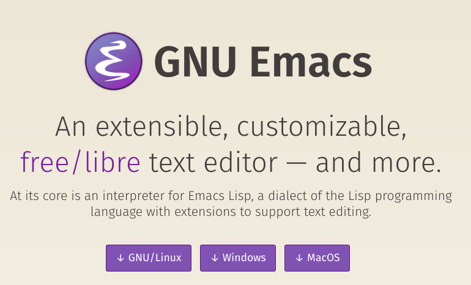
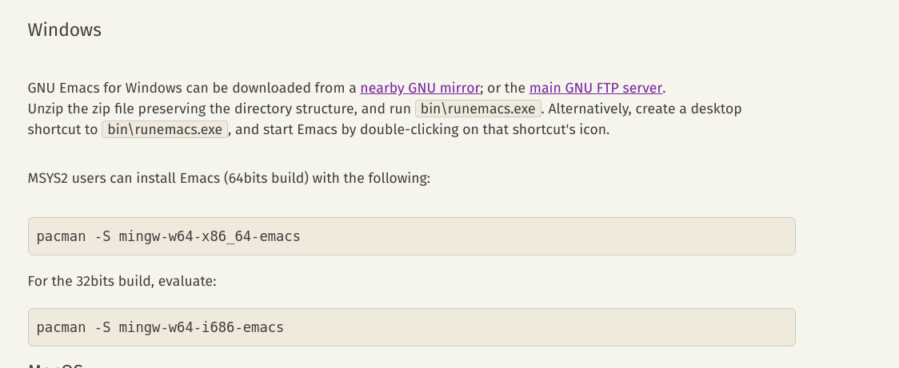
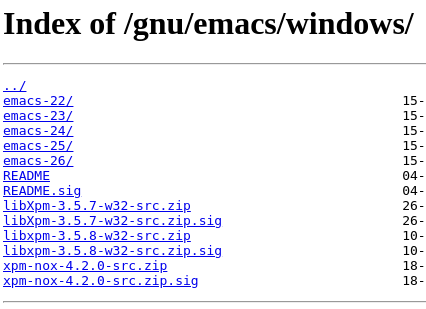
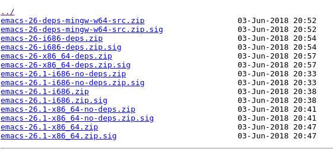

# emacs tutorial
## what is emacs?
An old but powerful editor.
## installation
### windows
1. go to the [main page](https://www.gnu.org/software/emacs/). Click windows button.

2. click the "nearby GNU mirror".

3. select the version you like. for example, "emacs-26".

4. select one file you want to download. for example, "emacs-26.1-x86_64.zip".

5. after downloading, unzip that file.
6. run "runemacs.exe".

### MacOS
1. download from [emacs for macosx](https://emacsformacosx.com/).
2. install.

### Linux
1. simple method: `sudo apt-get install emacs`
2. the other: 
   - go to http://gnu.mirror.globo.tech/emacs/ .
   - download package, extract it and compile.

## operation
### basic key
* C means Ctrl
* M means Alt (Windows, Linux), Command (MacOS)
* S means Shift
* C-a mean press Ctrl and a at the same time. 

### file
* open : C-x C-f
* save : C-x C-s
* close : you don't need to close a file. just open another file and edit.

### move
* move to previous line: C-p
* move to next line: C-n
* move backwords: C-b
* move forwards: C-f

### exit
* exit editor : C-x C-c
* exit current command : C-g

### window
* split window vertically : C-x 2
* split window horizontally : C-x 3
* delete current window : C-x 0
* delete other windows : C-x 1

## configuration
TODO

## org mode
TODO
## other distributions
TODO
### spacemacs
TODO
